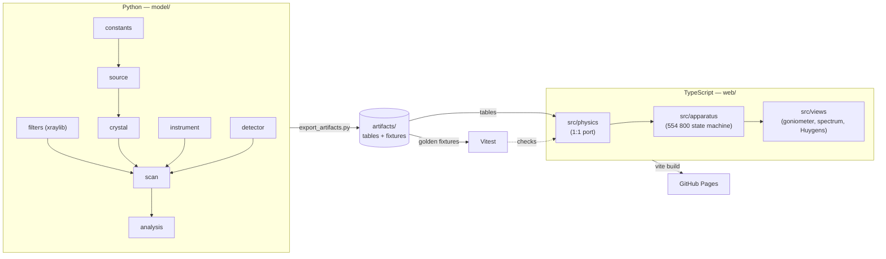
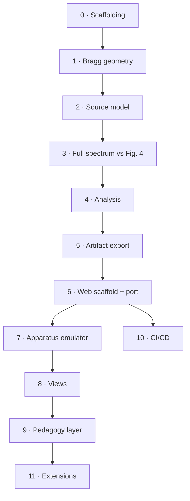
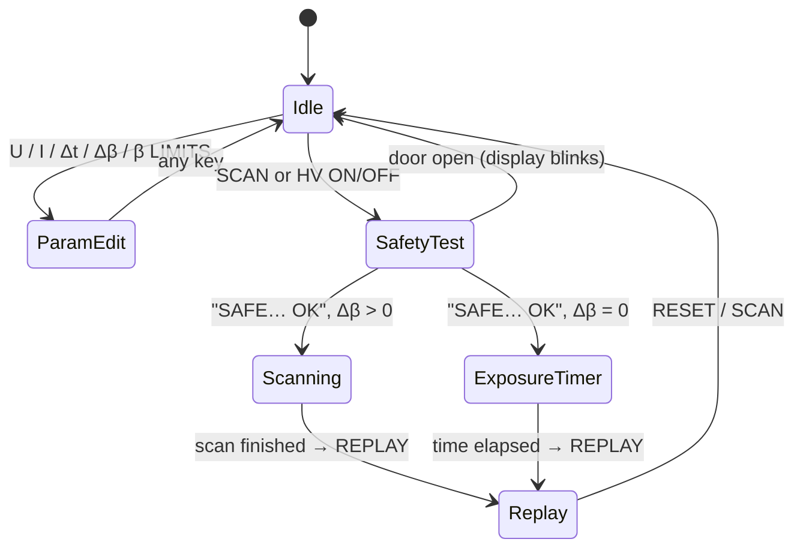

# Bragg Reflection Simulation — Project Plan

> [!abstract] Goal
> A browser-based, physics-driven, dynamical and educational simulation of the LD experiment **P6.3.3.1**: Bragg reflection of Mo characteristic X-rays at an NaCl monocrystal, using the **X-ray apparatus 554 800** with goniometer in 2:1 coupled mode. Runs on almost any device via GitHub Pages.

**Contents:** [[#Architecture]] · [[#Repository structure]] · [[#Environment]] · [[#Reference values]] · [[#Build plan]] · [[#Risks and notes]]

---

## Architecture

> [!info] Core idea
> **Python owns the truth, TypeScript owns the experience.**
> Python computes the physics and exports JSON *artifacts*; the TypeScript port loads them and must reproduce them in its tests. If both implementations disagree, CI fails.



### Two kinds of artifacts

| Artifact | Produced by | Consumed by | Purpose |
|---|---|---|---|
| `artifacts/tables/*.json` | Python (xraylib, NumPy) | Browser at runtime | Lookup data the browser can't compute cheaply (e.g. Zr transmission $T(\lambda)$) |
| `artifacts/fixtures/*.json` | Python reference model | Vitest | Input parameters + expected outputs for cross-language verification |

> [!important] Design rule — separate *expectation* from *noise*
> Every scan function returns the **deterministic expected count rate** $\bar R(\beta)$. Poisson sampling is a separate, final step.
> - Cross-language tests compare only $\bar R(\beta)$ (tight relative tolerance, e.g. $10^{-9}$).
> - Noise is tested **statistically** on each side (mean and variance over many samples), since NumPy and JS RNGs never match.

---

## Repository structure

```
bragg-sim/
├── environment.yml
├── README.md
├── LICENSE
├── .gitignore
├── .pre-commit-config.yaml
├── refs/                          # the two LD PDFs — GITIGNORED (LD Didactic copyright)
├── model/                         # Python reference package
│   ├── pyproject.toml
│   ├── src/braggsim/
│   │   ├── __init__.py
│   │   ├── constants.py           # d = 282.01 pm, Mo lines, K-edge, hc
│   │   ├── source.py              # continuum + characteristic lines vs U, I
│   │   ├── crystal.py             # Bragg geometry, orders, reflectivity
│   │   ├── filters.py             # transmission: air, absorber, Zr (xraylib)
│   │   ├── detector.py            # GM efficiency, dead time, Poisson sampling
│   │   ├── scan.py                # 2:1 coupled scan → expected rate R(β), incl. broadening
│   │   └── analysis.py            # peak centres, λ from θ
│   ├── tests/
│   │   ├── test_crystal.py
│   │   ├── test_source.py
│   │   ├── test_scan.py
│   │   └── test_analysis.py
│   ├── notebooks/
│   │   ├── 01_bragg_geometry.ipynb
│   │   ├── 02_source_model.ipynb
│   │   ├── 03_full_spectrum_vs_fig4.ipynb
│   │   └── 04_analysis_tables_3_5.ipynb
│   ├── data/
│   │   └── fig4_digitized.csv     # digitized Fig. 4 for calibration
│   └── scripts/
│       └── export_artifacts.py
├── artifacts/                     # GENERATED — committed, checked for freshness in CI
│   ├── tables/
│   └── fixtures/
├── web/
│   ├── package.json
│   ├── tsconfig.json
│   ├── vite.config.ts             # base: '/<repo-name>/'
│   ├── index.html
│   ├── src/
│   │   ├── main.ts
│   │   ├── physics/               # 1:1 port of braggsim (same function names)
│   │   ├── apparatus/             # control-panel state machine
│   │   ├── views/                 # goniometer canvas, spectrum plot, Huygens panel
│   │   ├── pedagogy/              # explore/lab modes, guided tasks
│   │   └── styles/
│   └── tests/                     # Vitest against artifacts/fixtures
└── .github/workflows/
    ├── test.yml
    └── deploy.yml
```

> [!warning] Don't commit the PDFs
> The instruction sheet and the leaflet are LD Didactic material. Keep them in `refs/` (gitignored) and cite them in the README.

---

## Environment

Managed with micromamba. JS packages (Vite, TypeScript, Vitest, uPlot) live in `web/package.json`, **not** in the yml — micromamba only provides `node` + `npm`.

```yaml
name: atom-sim
channels:
  - conda-forge
dependencies:
  - python=3.12
  - pip
  - numpy
  - scipy
  - pandas
  - xraylib
  - jupyterlab
  - ipywidgets
  - matplotlib
  - nbstripout
  - pytest
  - ruff
  - pre-commit
  - nodejs=24
```

```bash
micromamba create -f environment.yml
micromamba activate atom-sim
pip install -e ./model          # once model/pyproject.toml exists
cd web && npm install           # once web/package.json exists
```

---

## Reference values

> [!note] Extraction gotcha
> In the PDF text layer of the leaflet, the degree sign often renders as an **8** (`7.248` = 7.24°, `0.18` = 0.1°, `258` = 25°). Always check against the rendered page.

### Crystal and tube

| Quantity | Value | Source |
|---|---|---|
| NaCl lattice constant $a_0$ | 564.02 pm | Leaflet |
| Lattice plane spacing $d = a_0/2$ | 282.01 pm | Leaflet |
| Mo $K_\alpha$ | 17.443 keV · 71.080 pm | Leaflet, Table 1 |
| Mo $K_\beta$ | 19.651 keV · 63.095 pm | Leaflet, Table 1 |
| Mo K-edge (line threshold) | ≈ 20.0 keV | Standard tables (verify via xraylib) |
| Zr K-edge (filter) | ≈ 18.0 keV — between $K_\alpha$ and $K_\beta$ | Standard tables (verify via xraylib) |

### Expected glancing angles — Leaflet Table 2

| $n$ | $\theta(K_\alpha)$ | $\theta(K_\beta)$ |
|---|---|---|
| 1 | 7.24° | 6.42° |
| 2 | 14.60° | 12.93° |
| 3 | 22.21° | 19.61° |

### Apparatus limits — Instruction sheet 554 800

| Parameter | Range | Step | Default |
|---|---|---|---|
| Tube voltage $U$ | 0.0 – 35.0 kV | 0.1 kV | 5.0 kV |
| Emission current $I$ | 0.00 – 1.00 mA | 0.01 mA | 0.00 mA |
| Measuring time per step $\Delta t$ | 1 – 9999 s | 1 s | 1 s |
| Angular step $\Delta\beta$ | 0.0 – 20.0° (0.0 → exposure-timer mode) | 0.1° | 0.1° |
| Sensor arm | −10° … +170° | 0.1° | — |
| Target arm | unlimited (0 – 360°) | 0.1° | — |
| Rate display | max 9999 /s (internal 65 535 /s) | — | — |

### Leaflet measurement settings

$U = 35.0$ kV, $I = 1.00$ mA, $\Delta t = 10$ s, $\Delta\beta = 0.1°$, COUPLED, target limits 2° → 25°, $s_1 \approx 5$ cm, $s_2 \approx 6$ cm.

---

## Build plan

> [!tip] Rule of thumb
> Phases 1–4 are pure Python in Jupyter — that's where the real physics decisions happen. **Don't start the UI until Phase 3's spectrum looks like Fig. 4.** Everything after that is porting and presentation.



### Phase 0 — Scaffolding

- [x] Create the GitHub repo structure from [[#Repository structure]]
- [x] `micromamba create -f environment.yml`
- [x] `.gitignore` (include `refs/`, `node_modules/`, `web/dist/`, `.ipynb_checkpoints/`)
- [x] `.pre-commit-config.yaml` with ruff + nbstripout
- [x] `model/pyproject.toml` (src layout), `pip install -e ./model`
- [x] README: purpose, architecture diagram, references
- [x] Choose a license

> [!success] Done when
> `pip install -e ./model` works and an empty `pytest` run passes.

### Phase 1 — Constants and Bragg geometry

Files: `constants.py`, `crystal.py`

$$
n\lambda = 2d\sin\theta
$$

- [x] Physical constants and Mo line data in `constants.py`
- [x] `theta_from_lambda(lam, n, d)` and `lambda_from_theta(theta, n, d)`
- [x] Handle the no-reflection case ($n\lambda > 2d$)
- [x] Notebook `01_bragg_geometry.ipynb`

> [!success] Done when
> A test reproduces [[#Expected glancing angles — Leaflet Table 2|Table 2]] to two decimals.

### Phase 2 — Source model

File: `source.py`

**Continuum** (Kramers-type), cut off at the Duane–Hunt limit:

$$
\lambda_\text{min} = \frac{hc}{eU} \quad\Rightarrow\quad \lambda_\text{min}\,[\text{pm}] \approx \frac{1239.84}{U\,[\text{kV}]}
$$

$$
I_\text{cont}(\lambda) \propto I_e\, Z \left(\frac{\lambda}{\lambda_\text{min}} - 1\right)\frac{1}{\lambda^{2}}, \qquad \lambda > \lambda_\text{min}
$$

At 35 kV: $\lambda_\text{min} \approx 35.4$ pm → first-order $\theta \approx 3.6°$ (the dip near 3° in Fig. 4).

**Characteristic lines** — only for $U > U_K \approx 20.0$ kV:

$$
I_{K} \propto I_e \left(\frac{U}{U_K} - 1\right)^{m}
$$

with $m$ an empirical, tunable exponent; $K_\alpha : K_\beta$ ratio as a fit parameter.

- [x] Continuum function with correct cutoff
- [x] Line intensities with threshold behaviour
- [x] Line profiles (intrinsic width small vs. instrument width) → δ-lines in λ; all width comes from the instrument (Phase 3)
- [x] Notebook `02_source_model.ipynb`: $I(\lambda)$ vs $U$, $I_e$

> [!success] Done when
> Plots behave physically: lines vanish below ~20 kV, continuum edge moves with $U$, everything scales linearly with $I_e$.

### Phase 3 — From λ to what the counter sees

Files: `crystal.py`, `instrument.py`, `detector.py`, `scan.py`

Mapping the spectrum onto angle for orders $n = 1, 2, 3$ requires the Jacobian:

$$
\frac{d\lambda}{d\theta} = \frac{2d}{n}\cos\theta
$$

GM dead time (non-paralyzable model):

$$
R_\text{obs} = \frac{R}{1 + R\tau}
$$

- [x] Order-dependent reflectivity factor $r_n$ (fit parameter)
- [x] Gaussian angular broadening with width $\sigma(s_1, s_2)$ → single `sigma_deg` at the leaflet
      slits; $\sigma(s_2)$ deferred until a slit control exists (Phase 8/9)
- [x] GM efficiency $\varepsilon(\lambda)$ and dead time $\tau$ → $\varepsilon$ constant (degenerate with
      the absorber); $\tau$ = 100 µs fixed (Fig. 4 is flat in $\tau$)
- [x] Direct-beam leak term at small angles (the rise below ~3° in Fig. 4)
- [x] `scan.py`: coupled scan returning $\bar R(\beta)$ for given $U, I, \Delta\beta$, limits
- [x] Separate `sample_counts(R_bar, dt, rng)` for Poisson noise
- [x] Digitize Fig. 4 → `data/fig4_digitized.csv` (automatic pixel tracing, `scripts/digitize_fig4.py`)
- [x] Fit free parameters: overall scale, line/continuum ratio, $r_n$ → $m$ = 1.67 fixed from the
      literature (Fig. 4 has one voltage only)
- [x] Notebook `03_full_spectrum_vs_fig4.ipynb` — linear and log plots

Deviations from this plan (details in `model/PARAMETERS.md`):
- Three extra physics terms were needed for the continuum slope: Lorentz-polarization factor,
  air absorption (18 cm), and one fitted effective absorber (borosilicate glass, ≈ 1.4 mm).
- Kβ/Kα and the Kα₁/Kα₂, Kβ₁,₃/Kβ₂ fine structure come from xraylib (doublet moved here from Phase 11).
- The digitized figure is offset by +0.09° in β; a calibration-only offset, not in the model.
- No `instrument.py`: broadening lives in `scan.py`. Line tips come out 0.70–1.04 × Fig. 4 (known deviation).

> [!success] Done when
> The simulated spectrum qualitatively matches Fig. 4 in **both** linear and log scale, including relative peak heights across orders.

### Phase 4 — Analysis

File: `analysis.py`

- [x] Peak finding on (noisy) spectra
- [x] ~~Gaussian fit~~ → centroid ("Calculate Peak Center", as in the leaflet) for peak centres with uncertainties
- [x] $\lambda$ from $\theta$ per order; mean over orders
- [x] Notebook `04_analysis_tables_3_5.ipynb`

Deviations from this plan:
- Centroids replace the Gaussian fit. Kβ₂ (13 % of Kβ, 1.15 pm below Kβ₁,₃) separates from 2nd order on, so a
  Gaussian locks onto Kβ₁,₃ and gives λ(Kβ) ≈ 63.2 pm. The whole-peak centroid gives the blend mean that the leaflet
  quotes (63.09 pm). The marked half-window of 0.7° is documented in `model/PARAMETERS.md`.
- The analysis is Python only (notebook, future teacher key). It is not ported and has no fixtures.

> [!success] Done when
> Running the analysis on a simulated spectrum reproduces the workflow and values of leaflet Tables 3–5 (mean $\lambda(K_\alpha) \approx 71.07$ pm, $\lambda(K_\beta) \approx 63.08$ pm).

### Phase 5 — Artifact export

File: `scripts/export_artifacts.py`

- [x] `tables/`: μ/ρ of the materials the model uses (`mu_rho.json`) and the fitted `scan.DEFAULT`
      (`model_params.json`). There is no GM-efficiency table (ε is constant), and Zr is added with the Phase 11 filter
- [x] `fixtures/`: golden cases: default leaflet settings, $U$ below/at/above the K-edge, 10 kV, edge angles, full
      range, tube off, σ narrow/wide, `coupled_betas`, and `filters.transmission` directly (the table above ~150 pm
      barely shows in R̄). The Zr and $s_2$ cases wait for those features (Phases 11, 8/9)
- [x] Each fixture stores inputs, expected $\bar R(\beta)$, and a model version string
- [x] Deterministic output (sorted keys, shortest round-trip floats, LF). `tests/test_artifacts.py` fails when stale.
      It compares floats at 1e-12, not bytes, because numpy's SIMD exp/log/sin differ by one ulp between CPUs

Port constraints found in the Phase 0–3 review (needed for 1e-9 parity):
- ~~`scan._transmission` calls xraylib per point~~ → done: `filters.transmission` interpolates μ/ρ log–log
  on a fixed 1000-point λ grid (30–600 pm), and Python reads the **same** table it exports (68 KB instead of
  ≈ 0.6 MB for the θ grid first planned).
- Mirror numpy semantics exactly: `np.interp` holds end values; `np.round` in `coupled_betas` breaks
  ties to even (JS `Math.round` does not); `np.convolve(mode="same")` centring. The kernel half-width
  now uses `math.ceil`, which has no tie rule to get wrong.
- Vitest harness (from the Phase 5 review): relative 1e-9 with a tiny absolute floor (1e-12/s). The
  `tube_off_*` cases must come out exactly 0, and the smallest nonzero fixture value is ≈ 0.5/s.
  Also evaluate some βs one at a time against the batch values, which covers the live single-step path.
  An independent scalar port (libm, sequential convolution, half-up rounding) matched every fixture
  to 2e-15.
- Keep `scatter_per_s > 0` in fixtures: far tails reach ~1e-250 without it.
- Live single-β steps: cache the smoothed continuum per (U, params).
- Speed (from the Phase 4/5 review): take the log of the μ/ρ tables once at load, and cache the smoothed
  continuum and the line weights per (U, I, params). Without that, an "instant" 901-step scan recomputes
  everything per step and takes ≈ 1 s on a phone.
- Test with arrays: the Python functions return `np.float64` for scalar input, so fixtures always hold
  lists, and the TS API takes and returns arrays too.

> [!success] Done when
> Running the script twice produces byte-identical files, and a CI check fails if committed artifacts are stale.

### Phase 6 — Web scaffold and physics port

- [ ] `npm create vite@latest` → vanilla TypeScript
- [ ] Add Vitest and uPlot
- [ ] Set `base: '/<repo-name>/'` in `vite.config.ts`
- [ ] Port `braggsim` modules 1:1 into `src/physics/` (same names, same units)
- [ ] Vitest suite loading every fixture

> [!success] Done when
> All fixtures pass in Vitest.

### Phase 7 — Apparatus emulator

Folder: `src/apparatus/`



- [ ] Parameter ranges and steps from [[#Apparatus limits — Instruction sheet 554 800]]
- [ ] Keys: U, I, Δt, Δβ, β LIMITS, SENSOR, TARGET, COUPLED, ZERO, RESET, REPLAY, SCAN, HV ON/OFF, speaker
- [ ] Door interlock and "SAFE… OK" self-test
- [ ] Refuse scan if upper limit < lower limit (display flashes)
- [ ] ADJUST knob with dynamic response (faster turn → bigger increments)
- [ ] **Time acceleration** control (1×, 10×, 100×, instant)
- [ ] Hold U and I as integers (U in 0.1 kV, I in 0.01 mA) and convert only when calling the model. Summing
      0.01 mA a hundred times in floats gives 1.0000000000000007 mA, which the model rejects as > 1 mA

> [!example] Why time acceleration matters
> The leaflet scan (2° → 25°, $\Delta\beta = 0.1°$, $\Delta t = 10$ s) has 231 steps → $231 \times 10\ \text{s} \approx 38.5$ min of real time.

> [!success] Done when
> The full procedure of manual section 11 (a, b, f, h) can be performed step by step in the browser.

### Phase 8 — Views

Folder: `src/views/`

- [ ] **Goniometer canvas**: crystal at $\theta$, counter at $2\theta$, beam path
- [ ] **Live spectrum** (uPlot), point by point during scan; linear/log toggle
- [ ] **Huygens / path-difference panel**: highlights when $2d\sin\theta = n\lambda$
- [ ] **LED-style displays** mimicking the 554 800 panel
- [ ] Responsive layout; test on a phone

> [!success] Done when
> The app is usable and smooth on a phone screen.

### Phase 9 — Pedagogy layer

Folder: `src/pedagogy/`

- [ ] **Explore mode**: physics visible, sliders, overlays of expected angles
- [ ] **Lab mode**: raw data only, CSV export for student analysis
- [ ] Guided tasks, e.g. *"Find the voltage at which the characteristic lines disappear"*, *"Reduce $s_2$ until $K_\alpha$ and $K_\beta$ merge"*
- [ ] Optional teacher answer key generated from `analysis` outputs
- [ ] Line-threshold answer key: extrapolate the line area vs U to zero (≈ U_K = 20.0 kV), not "the first U
      where a peak is visible". The lines rise as (U/U_K − 1)^1.67, so a visible peak appears only well above U_K

### Phase 10 — CI/CD

- [ ] `test.yml`: `mamba-org/setup-micromamba` → pytest → artifact freshness check → `npm ci` → Vitest
- [ ] `deploy.yml`: build `web/` → `actions/upload-pages-artifact` → `actions/deploy-pages`
- [ ] Enable Pages (source: GitHub Actions) in repo settings

> [!success] Done when
> A push to `main` runs all tests and publishes the site automatically.

### Phase 11 — Extensions

- [ ] Zr filter toggle (suppresses $K_\beta$). Add Zr to `mu_rho.json`. The μ/ρ grid smears its K edge
      (68.89 pm) over one 0.3 % step (≈ 0.02° in 1st order, far below σ), so note that in PARAMETERS.md
- [x] $K_{\alpha 1}/K_{\alpha 2}$ doublet, resolvable at third order (Δθ ≈ 0.14°) → in the model since Phase 3
- [ ] Other anodes: Cu, Fe, Ag, W
- [ ] Other crystals: LiF, KBr
- [ ] Duane–Hunt experiment (Planck's constant from $\lambda_\text{min}$)
- [ ] Moseley's law experiment

---

## Risks and notes

> [!warning] Model calibration
> Several parameters ($m$, $r_n$, $\varepsilon(\lambda)$, $\tau$, direct-beam leak) are effectively empirical. Document each one with its fitted value and what it was fitted to, so the model stays honest.

> [!warning] Hardware version mismatch
> The leaflet was written for the older **554 811** (RS-232, Windows 9x); the instruction sheet is for the **554 800** (USB). Emulate the **554 800** panel — that's the lab hardware.

> [!question] Open decisions
> - ~~License for code vs. educational content~~ → MIT (code) + CC BY 4.0 (content)
> - ~~Language(s) of the UI~~ → Spanish (default) + English
> - Whether to validate against real measurements from the EPN apparatus later

%% Keep this note in sync with the repo README once Phase 0 is done. %%
