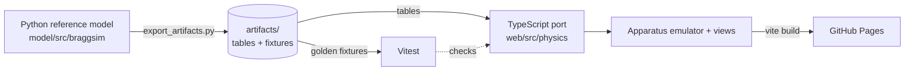

# Bragg reflection simulation

[](https://github.com/TecnicoLabFisica/AtomicSimulation/actions/workflows/test.yml)

A browser-based, physics-driven and educational simulation of **Bragg reflection of Mo Kα/Kβ X-rays
at an NaCl monocrystal**. It follows the experiment LD P6.3.3.1 on the LD X-ray apparatus **554 800**,
with the goniometer in 2:1 coupled mode. It is meant to run on almost any device through GitHub Pages.

> **Status:** in development. The Python reference model is calibrated against the leaflet's
> measured spectrum. The web app emulates the 554 800 and has guided tasks.
> Live at <https://tecnicolabfisica.github.io/AtomicSimulation/>, deployed on every green push to `main`.

## Using it in class

The app has two modes, switched in the **Learn** sheet:

- **Explore** shows the physics: the expected line angles on the goniometer and the spectrum, the band
  the tube cannot reach (λ < λ_min), the path difference 2d sin θ, and sliders for U and I. You can drag
  the crystal to turn it.
- **Lab** shows only what the real bench shows: the 554 800 panel, the arms and the measured counts.
  Students take their data as CSV and analyse it themselves, as in LD P6.3.3.1, Tables 3–5.

Guided tasks follow *predict → act → observe → explain*, and the app checks when each one is done. For
teachers, open the app with `?teacher` in the URL to see a note on each task. The expected results, from
simulated data, are in [`docs/teacher-key.md`](docs/teacher-key.md) (generated by
`model/scripts/teacher_key.py`). Lab mode is honour-based: students can still switch modes or add
`?teacher`, so it hides answers from the curious, not from the determined.

## Architecture

**Python owns the truth, TypeScript owns the experience.** A Python reference model (`model/`)
computes the physics and exports JSON artifacts. The TypeScript web app (`web/`) ports the
model 1:1 and must reproduce those artifacts in its tests.



Design rule: every scan function returns the **deterministic expected count rate** R̄(β).
Poisson counting noise is a separate, final step.

## Setup

Requires [micromamba](https://mamba.readthedocs.io/) (or conda/mamba).

```bash
micromamba create -f environment.yml
micromamba run -n atom-sim pip install -e ./model
micromamba run -n atom-sim pre-commit install
micromamba run -n atom-sim pytest model
```

`xraylib` comes from conda-forge through `environment.yml`, not from pip.

## References

- LD Didactic, *Physics Leaflet P6.3.3.1: Bragg reflection: diffraction of X-rays at a monocrystal*.
- LD Didactic, *Instruction sheet 554 800: X-ray apparatus*.
- T. Schoonjans et al., *The xraylib library for X-ray–matter interactions. Recent developments*,
  Spectrochim. Acta B 66 (2011) 776–784. <https://github.com/tschoonj/xraylib>
- H. A. Kramers, *On the theory of X-ray absorption and of the continuous X-ray spectrum*,
  Phil. Mag. 46 (1923) 836–871.
- M. Green and V. E. Cosslett, *Measurements of K, L and M shell X-ray production efficiencies*,
  J. Phys. D 1 (1968) 425–436.
- B. E. Warren, *X-ray Diffraction* (Addison-Wesley, 1969).

Empirical model parameters and how they were fitted: [`model/PARAMETERS.md`](model/PARAMETERS.md).

The LD documents are copyrighted and are not included in this repository. We use only
paraphrased facts and numerical values from them, and we cite them wherever they are used.

## License

- Code: [MIT](LICENSE).
- Educational content we create (texts, guided tasks, figures): [CC BY 4.0](LICENSE-CONTENT).
